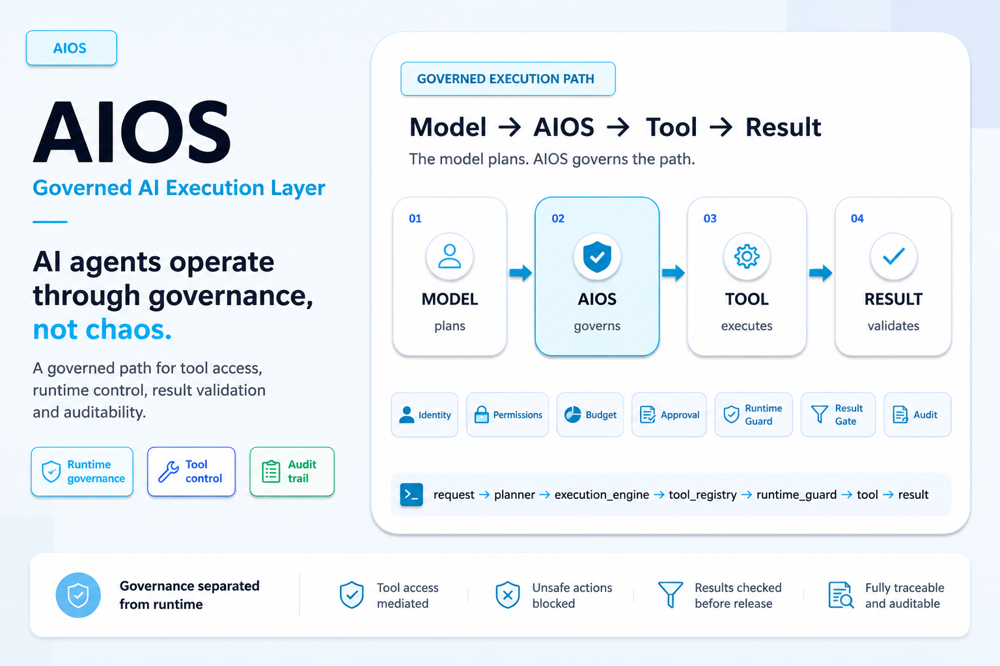

# RobyRoy AIOS Public Demo



[](#status)
[](#enterprise-evidence-alignment)
[](#what-is-not-public)
[](#governed-execution-backbone)

AIOS is presented here as **a Governed AI Execution Layer**.

AIOS is a platform concept for governing how AI uses business tools, data, and workflows. This repository is the public-facing technical demo and documentation package for a source-private AIOS enterprise track. It explains the governed execution model, exposes a small public mock runtime, and summarizes public-safe internal/staging evidence without publishing private runtime source.

## Quick Links

| Area | Link |
| --- | --- |
| Public docs index | [docs/public/aios-v2/README.md](docs/public/aios-v2/README.md) |
| Public overview | [AIOS_PUBLIC_OVERVIEW.md](docs/public/aios-v2/AIOS_PUBLIC_OVERVIEW.md) |
| Architecture | [AIOS_ARCHITECTURE.md](docs/public/aios-v2/AIOS_ARCHITECTURE.md) |
| Governance model | [AIOS_GOVERNANCE_MODEL.md](docs/public/aios-v2/AIOS_GOVERNANCE_MODEL.md) |
| Demo and evidence package | [AIOS_DEMO_AND_EVIDENCE_PACKAGE.md](docs/public/aios-v2/AIOS_DEMO_AND_EVIDENCE_PACKAGE.md) |
| Agent integration readiness | [AIOS_AGENT_INTEGRATION_READINESS.md](docs/public/aios-v2/AIOS_AGENT_INTEGRATION_READINESS.md) |
| Status and limits | [AIOS_STATUS_AND_LIMITS.md](docs/public/aios-v2/AIOS_STATUS_AND_LIMITS.md) |
| FAQ | [AIOS_FAQ.md](docs/public/aios-v2/AIOS_FAQ.md) |

## What AIOS Is

AIOS separates planning, authorization, execution, validation, and audit.

The public claim is specific: the model does not act directly. It plans. AIOS governs the path between request, tool, and result.

```text
Model -> AIOS -> Tool -> Result
```

In the fuller governed backbone, the agent can prepare intent, but execution must pass through explicit control surfaces. No tool is used outside the governed path.

## Enterprise Evidence Alignment

This public package is aligned with the current enterprise documentation and reports at an aggregate, public-safe level.

| Evidence area | Public-safe status |
| --- | --- |
| Enterprise staging gate | Passed with an explicit non-public-distribution posture. |
| Package/installability | Non-editable package/install checks passed in controlled internal validation. |
| Enterprise validation evidence | Internal enterprise reports record 516 passing tests in the private enterprise/staging validation scope. |
| Runtime hardening | Internal/staging runtime hardening checks passed. |
| Governance hardening | Policy, capability, approval, budget, memory/state, and run-supervision evidence is documented internally. |
| Runtime governance wiring | E2E enforcement demonstrated through the real planned-step path in internal/staging tests. |
| Result boundary | Result-gate checks and raw-output protection are documented in internal/staging hardening evidence. |
| Audit/replay | Minimal audit/replay and trace evidence is documented internally for reviewable execution order. |
| External agent evaluation | Connector-readiness audit completed; minimal connector shape demonstrated; real third-party agent integration remains future work. |
| Public/private boundary | Boundary review classifies raw implementation, raw tests, local paths, logs, and traces as private/internal. |

The public interpretation is deliberately conservative: AIOS has internal/staging evidence for enterprise governance, runtime control, package/install checks, and connector evaluation. This repo does not publish the private runtime core and does not turn those internal results into unrestricted public deployment claims.

## Why Agent Governance Needs A Control Layer

Current AI systems accelerate answers, analysis, and automation. The risk shift happens when AI moves from response to action.

The risk is not only what the model answers. It is what the model-driven process can do before answering.

Direct model-to-tool patterns are easy to prototype, but hard to govern once agents can touch files, APIs, workflows, data stores, or business operations. Traditional approaches often concentrate too much decision power inside the model. AIOS does not replace the model; it governs the path between request, tool, and result.

AIOS focuses on the execution boundary:

| Concern | Direct agent path | AIOS-governed path |
| --- | --- | --- |
| Planning | Model output may become action | Plan is separated from execution |
| Tool access | Tool call can be implicit | Tool must be declared through a registry |
| Runtime decision | Often external or partial | Guard decision occurs before tool execution |
| Result release | Output may be returned as-is | Result passes through a result gate |
| Evidence | Hard to reconstruct | Trace and proof cases make behavior inspectable |

The difference is not "more AI". The difference is AI under control.

## Governed Execution Backbone

The canonical public backbone is:

```text
request -> planner -> execution_engine -> tool_registry -> runtime_guard -> tool -> result_gate -> result
```

| Stage | Public meaning |
| --- | --- |
| `request` | A user, system, or normalized external-agent request enters the governed path. |
| `planner` | The agent-facing planning layer prepares intended work. |
| `execution_engine` | Planned work is executed through a controlled runtime sequence. |
| `tool_registry` | Only declared tools are exposed to the governed path. |
| `runtime_guard` | Tool execution is allowed, warned, blocked, or paused before the tool runs. |
| `tool` | The selected capability runs only after the governed path permits it. |
| `result_gate` | Tool output is checked, shaped, redacted, or blocked before release. |
| `result` | The final output is returned with the governed path preserved. |

## How AIOS Controls Tool Execution

- tool access is mediated through `tool_registry`
- `runtime_guard` stands before the tool
- `BLOCK` means the tool does not execute
- `WARN` keeps execution visible instead of silent
- policy, capability, budget, approval, memory/state, and supervision checks can run before registry/tool execution when structured governance context is supplied
- `result_gate` protects outward output after the tool runs
- governance records and audit evidence stay separate from runtime side effects
- the value is not isolated controls; the value is preventing the governed path from being skipped

## 🧱 10 enterprise governance layers already demonstrated

AIOS is not based on a single control point.  
It is designed as a governed execution path made of distinct enterprise governance layers.

| Layer | Governance role |
|---|---|
| Agent Identity | Defines who or what is acting |
| Capability Permissions | Defines what the agent is allowed to do |
| Budget & Limits | Controls how much the run can consume |
| State Control | Keeps state separate from authorization |
| Approval Gates | Pauses sensitive actions for explicit approval |
| Memory Governance | Controls how memory is used and constrained |
| Tool Contract | Ensures tools are declared and bound |
| Run Supervision | Handles loop, retry and escalation behavior |
| Audit Replay | Supports run reconstruction and review |
| Policy Packs | Applies operational postures and governance rules |

Every AI action must be authorized, limited, traceable and validatable.

## What Can Be Tested

The public package supports controlled, local, public-safe checks:

| Testable area | Where |
| --- | --- |
| Public mock `ALLOW`, `WARN`, and `BLOCK` behavior | [public_mock_runtime/README.md](public_mock_runtime/README.md) |
| Backbone consistency across public docs and examples | [backbone_public_test/README.md](backbone_public_test/README.md) |
| Result handling as an additive post-tool control | [examples/result-redaction-case.json](examples/result-redaction-case.json) |
| Governance approval without automatic runtime effect | [examples/governance-override-example.json](examples/governance-override-example.json) |
| Public proof artifacts comparing governed and generic execution | [docs/public-proof-tests/README.md](docs/public-proof-tests/README.md) |
| Public-safe enterprise test highlights | [docs/public/aios-v2/AIOS_TEST_HIGHLIGHTS.md](docs/public/aios-v2/AIOS_TEST_HIGHLIGHTS.md) |

## 🧪 Tests and evidence

This public repository includes a small public demo test surface and mock runtime proof tests.

The private enterprise/staging validation suite is not published here. The latest read enterprise report records 516 passing tests in the private enterprise/staging validation scope, covering governance, runtime hardening, package/installability, result-boundary behavior, audit/replay and connector-readiness checks.

The public tests make the concept inspectable.  
The enterprise evidence shows that AIOS is not only a concept page.

[Read the public-safe AIOS test highlights](docs/public/aios-v2/AIOS_TEST_HIGHLIGHTS.md)

Example local checks:

```bash
python3 public_mock_runtime/mock_runtime.py public_mock_runtime/examples/allow.json
python3 public_mock_runtime/mock_runtime.py public_mock_runtime/examples/warn.json
python3 public_mock_runtime/mock_runtime.py public_mock_runtime/examples/block.json
python3 -m unittest discover -s public_mock_runtime/proof_tests -p 'test_*.py'
python3 -m unittest discover -s tests -p 'test_*_public.py'
```

The `BLOCK` mock case is expected to stop before tool execution. A non-zero CLI exit can be the expected controlled outcome for that blocked request.

## What Is Public Here

- public technical package
- demo and documentation repository
- governed execution backbone
- public mock runtime
- public JSON examples
- adapted public tests
- public proof artifacts
- redacted enterprise evidence summary
- architecture, governance, status, roadmap, and FAQ documents

## What Is Not Public

- private AIOS source code
- private runtime core
- private orchestration internals
- private package internals
- private prompts, memory, bridge flows, or operational wiring
- private environment configuration
- private runtime installation path
- full private test files or raw internal reports
- raw logs, trace payloads, or audit replay internals

The public repository is intentionally source-private. The core runtime is not publicly released here.

## Controlled Technical Review

This package is prepared for controlled technical review and agent-integration evaluation.

The reviewable surface is intentionally bounded:

- the public backbone can be inspected
- the mock runtime can be run locally
- the proof cases can be read and tested
- the governance model can be evaluated at the architecture level
- enterprise evidence can be reviewed as an aggregate public-safe summary
- the public/private boundary is stated explicitly

The adoption path is intentionally progressive: controlled pilot, audit, then extension. The customer does not just get an answer; they get a governed answer.

## 📄 Public presentation

The public presentation deck explains the AIOS concept, the governance problem, the controlled execution path and the adoption model.

[Download the AIOS Governed AI Execution Layer PDF](docs/public/AIOS_Governed_AI_Execution_Layer.pdf)

## Repository Map

| Path | Purpose |
| --- | --- |
| [docs/public/aios-v2/](docs/public/aios-v2/) | Main public documentation package |
| [docs/public-proof-tests/](docs/public-proof-tests/) | Public proof artifacts |
| [public_mock_runtime/](public_mock_runtime/) | Small executable public mock runtime |
| [backbone_public_test/](backbone_public_test/) | Public backbone test guide |
| [examples/](examples/) | Curated JSON cases |
| [tests/](tests/) | Public invariant tests |
| [assets/](assets/) | Public logo and hero assets |
| [reference/](reference/) | Glossary and public invariants |

## Status

This is a public demo and documentation repository for a source-private AIOS enterprise track.

Public-safe enterprise alignment supports these statements:

- enterprise-staging-ready documentation/demo package
- internal/staging governance and runtime evidence exists
- package/installability checks passed in controlled internal validation
- governance wiring and E2E enforcement were demonstrated in internal/staging tests
- external-agent connector evaluation is ready for controlled pilot work
- public package is prepared for controlled technical review and agent-integration testing

It should not be interpreted as a public runtime distribution, unrestricted customer deployment evidence, external security certification, legal/compliance review, or publication of the private AIOS core.

## License

This repository is released under the [MIT License](LICENSE).
