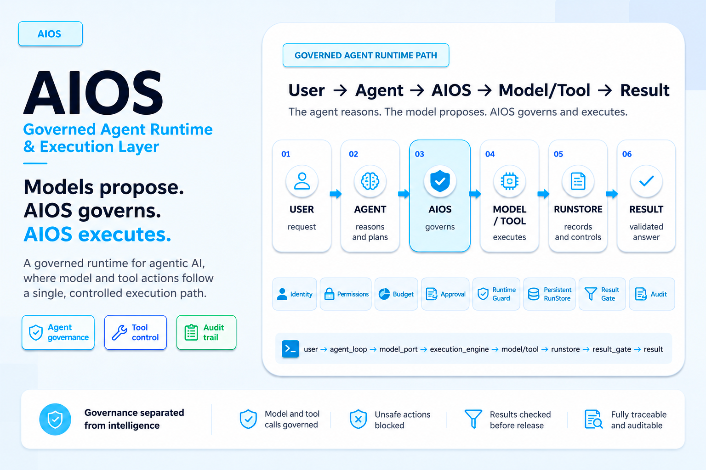

# AIOS — Governed Agent Runtime & Execution Layer



[](docs/public/aios-v3/README.md)
[](docs/public/aios-v3/AIOS_V3_P0_EVIDENCE.md)
[](docs/public-vs-private-boundary.md)
[](docs/public/aios-v2/README.md)

**Because AI agents need brakes, not just engines.**

AIOS is a governed agent runtime and execution layer for systems in which models can propose actions, call models, use tools, and affect real workflows.

> **Models propose. AIOS governs. AIOS executes.**

This repository is the public technical documentation and demonstration package for a source-private AIOS track. It publishes architecture, properties, limits, aggregate validation evidence, and small V2-shaped public demonstrations. It does not publish the private V3 runtime.

## V3 P0 Current Status

**AIOS V3 P0 — Governed Agent Runtime** is complete in its declared validation scope.

| Signal | Public-safe result |
| --- | --- |
| Milestone | AIOS V3 P0 completed |
| Gate | `AIOS_V3_P0_GATE=PASS` |
| Targeted P0 tests | **562/562 PASS** |
| Adversarial Remediation Gate | **354/354 PASS** |
| Governed model/tool round-trip | Verified |
| Persistence/reopen/resume | Verified in the synthetic P0 scope |
| Model boundary | Provider-neutral `ModelPort` |
| First real provider | OpenAI |
| Exact validated model | `gpt-5.6-sol` |
| Live provider evidence | One governed invocation returned `AIOS_LIVE_OK` |

These results are aggregate, scope-bound engineering evidence. They are not a security certification, formal verification, or an unrestricted production-readiness claim.

[Read the AIOS V3 P0 public documentation](docs/public/aios-v3/README.md).

## What AIOS Is

AIOS separates model proposals and agent coordination from execution authority.

In V3 P0:

- `AgentLoop` coordinates the run but does not possess execution authority;
- model calls and tool calls traverse the governed execution backbone;
- `ModelPort` keeps the provider replaceable;
- `ExecutionEngine` remains the execution authority;
- conversation state and execution truth remain separate;
- retry and recovery fail closed;
- `UNKNOWN_EFFECT` blocks blind re-execution;
- executable/artifact identity, budget accounting, credential egress, and content provenance remain governed;
- persistence, replay, reopen, and resume avoid duplicate execution within the verified P0 scope;
- the Composition Root assembles P0 components without becoming a public implementation contract.

The model can propose work. It cannot make its proposal self-authorizing.

## Governed Execution Backbone

### Current V3 P0 architecture

```text
User
  -> AgentLoop
  -> ModelPort / GovernedModelPort
  -> ExecutionEngine
  -> governed model or tool execution
  -> RunStore / ResultGate / audit
  -> AgentLoop
  -> final answer
```

This is a high-level authority and data-flow description. Private class structure, schemas, authorization and approval mechanisms, trust-boundary details, probes, configuration, and deployment wiring are intentionally not disclosed.

### V2 public backbone

AIOS V2 established the public governed-execution reference path:

```text
request -> planner -> execution_engine -> tool_registry -> runtime_guard -> tool -> result_gate -> result
```

The V2 path remains the basis of the small public mock runtime and its public invariant tests. V3 extends governance into the agent loop and model-call path; it does not retroactively rewrite V2 evidence.

## V2 Historical Evidence Preserved

AIOS V2 remains documented as **AIOS V2 — Governed Execution Backbone**. The complete public V2 package, field tests, proof tests, and demonstration runtime remain in this repository as evidence of the preceding phase.

### At-most-once execution evidence

The V2 private enterprise runtime was adversarially validated within its declared persistent-runtime scope against duplicate ownership and blind re-execution. When an effect may have occurred but the outcome cannot be proven, the documented runtime converges to `UNKNOWN_EFFECT` rather than automatically retrying.

| V2 evidence | Historical result |
| --- | --- |
| At-most-once semantics | Verified in the declared V2 persistent-runtime scope |
| Concurrent duplicate callers | Blocked from duplicate ownership/execution |
| Repeated race validation | **125/125 passed** |
| V2 private enterprise suite snapshot | **927 tests passed + 6525 subtests passed** |
| Accounting/audit convergence | **PARTIAL** |
| Distributed/multi-host guarantee | **NOT CLAIMED** |

[Read the V2 at-most-once evidence](docs/public/aios-v2/AT_MOST_ONCE_EXECUTION_EVIDENCE.md).

### ANDY controlled field tests

- The 2026-05-17 controlled Docker field test reported **13/13 checks passed**, with governed requests routed through AIOS, blocked cases remaining non-executed, and no direct bypass observed in that scope.
- The 2026-05-22 controlled Docker/VPS bypass-attempt follow-up reported **8/8 scenarios PASS**, with no useful action observed outside the governed backbone and no execution recorded outside the governed route.

These are controlled V2 field-test snapshots, not production-readiness or security-certification claims.

- [ANDY controlled field-test evidence](docs/public/field-tests/andy-aios-2026-05-17/README.md)
- [ANDY bypass-attempt evidence](docs/public/field-tests/andy-backbone-bypass-2026-05-22/ANDY_BACKBONE_BYPASS_ATTEMPT_EVIDENCE.md)
- [V2 public proof tests](docs/public-proof-tests/README.md)
- [V2 external public-mock validation](docs/public/aios-v2/AIOS_EXTERNAL_PIPELINE_VALIDATION.md)

## V3 P0 Evidence

The public V3 evidence is deliberately aggregate.

One real OpenAI provider invocation passed through the governed path using exact model `gpt-5.6-sol`:

| Signal | Observed result |
| --- | --- |
| Response | `AIOS_LIVE_OK` |
| RunStore | `SUCCEEDED` |
| `model_calls` | `1` |
| `tool_calls` | `0` |
| `network_calls` | `1` |
| `retries` | `0` |
| ResultGate | `ALLOW` |
| Fallback | None |
| Retry | None |
| Raw-secret leak | None observed |

This is one successful governed invocation, not a reliability benchmark or a broad provider claim. See [AIOS V3 P0 Evidence](docs/public/aios-v3/AIOS_V3_P0_EVIDENCE.md) and [Status and Limits](docs/public/aios-v3/AIOS_V3_STATUS_AND_LIMITS.md).

## Quick Links

| Area | Link |
| --- | --- |
| V3 public index | [docs/public/aios-v3/README.md](docs/public/aios-v3/README.md) |
| V3 overview | [AIOS_V3_P0_OVERVIEW.md](docs/public/aios-v3/AIOS_V3_P0_OVERVIEW.md) |
| V3 architecture | [AIOS_V3_ARCHITECTURE.md](docs/public/aios-v3/AIOS_V3_ARCHITECTURE.md) |
| V3 evidence | [AIOS_V3_P0_EVIDENCE.md](docs/public/aios-v3/AIOS_V3_P0_EVIDENCE.md) |
| V3 status and limits | [AIOS_V3_STATUS_AND_LIMITS.md](docs/public/aios-v3/AIOS_V3_STATUS_AND_LIMITS.md) |
| AIOS in 5 minutes | [docs/public/AIOS_IN_5_MINUTES.md](docs/public/AIOS_IN_5_MINUTES.md) |
| Integration model | [docs/public/AIOS_INTEGRATION_MODEL.md](docs/public/AIOS_INTEGRATION_MODEL.md) |
| V2 historical index | [docs/public/aios-v2/README.md](docs/public/aios-v2/README.md) |
| Public/private boundary | [docs/public-vs-private-boundary.md](docs/public-vs-private-boundary.md) |

## Why Agent Governance Needs A Runtime

The risk changes when AI moves from answer to action. A model that can request tools, files, APIs, databases, or business workflows can create effects before the final answer is reviewed.

Direct model-to-tool patterns are useful prototypes, but the model should not be the final authority over execution. AIOS puts an independent runtime boundary between a proposal and its operational effect, then keeps result release and authoritative execution state inside that governed path.

| Concern | Direct agent path | AIOS-governed path |
| --- | --- | --- |
| Model output | Proposal can become action | Proposal remains non-authoritative |
| Model and tool calls | May use separate or implicit paths | Both traverse the governed backbone |
| Execution authority | Can be blurred into orchestration | Remains with `ExecutionEngine` |
| Recovery | Retry may duplicate an uncertain effect | Fail-closed recovery and `UNKNOWN_EFFECT` block blind retry |
| State | Conversation and execution may be conflated | Conversation state and execution truth remain separate |
| Results | Output may be returned directly | `ResultGate` controls outward release |
| Evidence | Hard to reconstruct | Run state and audit remain reviewable |

## What Can Be Tested

The repository's executable public test surface remains intentionally small and V2-shaped:

| Testable area | Where |
| --- | --- |
| Public mock `ALLOW`, `WARN`, and `BLOCK` behavior | [public_mock_runtime/README.md](public_mock_runtime/README.md) |
| V2 backbone consistency across docs and examples | [backbone_public_test/README.md](backbone_public_test/README.md) |
| Result handling as an additive post-tool control | [examples/result-redaction-case.json](examples/result-redaction-case.json) |
| Governance approval without automatic runtime effect | [examples/governance-override-example.json](examples/governance-override-example.json) |
| Public proof artifacts | [docs/public-proof-tests/README.md](docs/public-proof-tests/README.md) |

The V3 test suite and runtime source are private. The V3 evidence published here is aggregate and cannot be reproduced from the public mock runtime.

Local public checks:

```bash
python3 public_mock_runtime/mock_runtime.py public_mock_runtime/examples/allow.json
python3 public_mock_runtime/mock_runtime.py public_mock_runtime/examples/warn.json
python3 public_mock_runtime/mock_runtime.py public_mock_runtime/examples/block.json
python3 -m unittest discover -s public_mock_runtime/proof_tests -p 'test_*.py'
python3 -m unittest discover -s tests -p 'test_*_public.py'
```

The `BLOCK` mock case is expected to stop before tool execution and can return a non-zero CLI exit code.

## What Is Public Here

- V3 architecture, properties, status, limits, and aggregate evidence;
- the complete historical V2 public documentation package;
- a small V2-shaped public mock runtime;
- curated JSON examples and adapted public tests;
- public proof artifacts and sanitized field-test evidence;
- reference terminology and invariants.

## What Is Not Public

- V3 source code or private implementation details;
- private test source or fixtures;
- raw `RunStore` schema;
- private authorization, approval, and trust-boundary mechanisms;
- detailed exploit or adversarial probes;
- private prompts or operator internals;
- local paths, credentials, or credential fragments;
- raw audit records, logs, or traces;
- private configuration or deployment internals.

This is **bounded technical disclosure**: public properties, architecture, and aggregate evidence without a public replica of the private runtime.

## Public Presentation

The existing presentation is an AIOS V2 historical artifact. It explains the governed execution concept and remains available without being relabeled as a V3 runtime publication.

[Download the AIOS V2 Governed AI Execution Layer PDF](docs/public/AIOS_Governed_AI_Execution_Layer.pdf).

## Repository Map

| Path | Purpose |
| --- | --- |
| [docs/public/aios-v3/](docs/public/aios-v3/) | Current V3 P0 public documentation |
| [docs/public/aios-v2/](docs/public/aios-v2/) | Preserved V2 historical documentation and evidence |
| [docs/public/field-tests/](docs/public/field-tests/) | Sanitized V2 ANDY field-test evidence |
| [docs/public-proof-tests/](docs/public-proof-tests/) | Preserved V2 public proof artifacts |
| [public_mock_runtime/](public_mock_runtime/) | Minimal V2-shaped executable demonstration |
| [backbone_public_test/](backbone_public_test/) | V2 backbone consistency guide |
| [examples/](examples/) | Curated V2 public JSON cases |
| [tests/](tests/) | Public invariant tests for the V2 demonstration surface |
| [reference/](reference/) | Version-aware glossary and public invariants |

## Status

The current public milestone is **AIOS V3 P0 — Governed Agent Runtime**, with `AIOS_V3_P0_GATE=PASS` and the aggregate evidence stated above.

The public repository remains a documentation and demonstration package, not a V3 runtime distribution. V2 evidence remains historical and testable. V3 implementation and validation internals remain private.

The repository should not be interpreted as unrestricted deployment evidence, a security certification, legal or compliance approval, or a claim that every integration and environment has been validated.

## License

This repository is released under the [MIT License](LICENSE).
