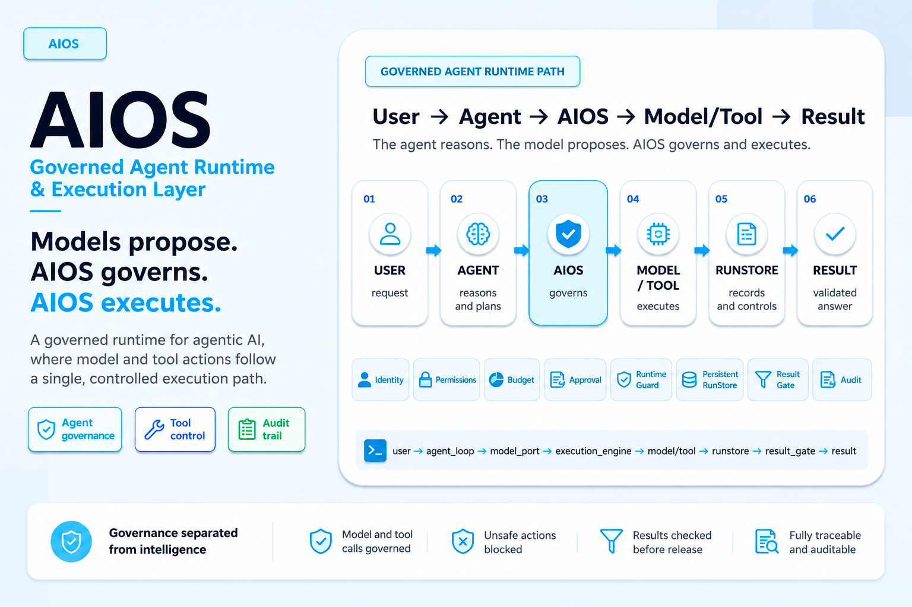
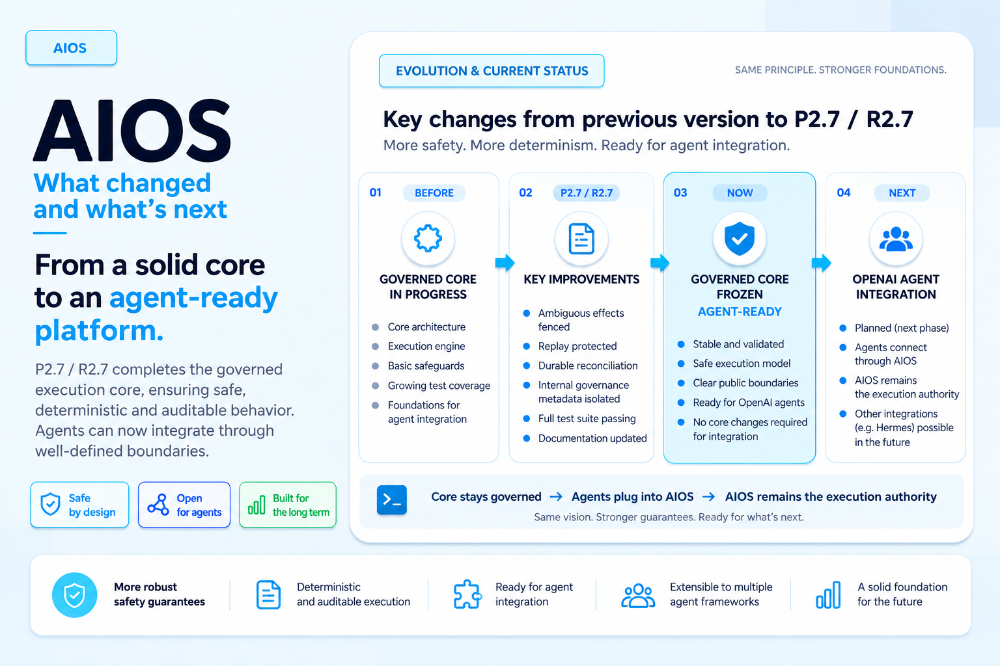

# AIOS — Governed Agent Runtime & Execution Layer




## What AIOS Is

AIOS separates model proposals and agent coordination from execution authority.

Across the V3 capabilities completed within their declared scopes:

- `AgentLoop` coordinates a run but does not possess execution authority;
- model calls and tool calls traverse the governed execution backbone;
- `ModelPort` keeps the provider replaceable;
- `ExecutionEngine` remains the execution authority;
- conversation state and execution truth remain separate;
- bounded WRITE requires the applicable authority and explicit approval where required;
- retry and recovery fail closed;
- `UNKNOWN_EFFECT` blocks blind re-execution;
- persistence, replay, reopen, and resume remain limited to their verified identity and persistence scope;
- `ResultGate` controls outward result release.

The model or an external host can propose work. Neither can make its proposal self-authorizing.

## What AIOS Actually Does

The agent decides what it wants to do. AIOS decides whether that intent may become a real effect, executes the admitted action, and verifies what actually happened. This describes the bounded capabilities validated in the private runtime.

```text
AGENT -> proposes an action
AIOS  -> policy -> capability -> budget -> approval where required
      -> approval authenticity and one-shot consumption -> effect/replay checks
      -> governed execution
REAL EFFECT -> effect observation
AIOS  -> verifies what actually happened -> ResultGate -> RESULT
```

| Component | Practical role |
| --- | --- |
| `AgentLoop` / native multi-agent | Coordinates one bounded run and its specialist roles; agents do not execute effects directly. |
| `GovernedActionPort` / `ExecutionEngine` | Separates intent from the AIOS authority that admits and executes work. |
| Policy / capability / budget | Decide which action is allowed, which surface is admitted, and how much work may occur. |
| Approval / one-shot binding | Sensitive actions wait; the authorization is consumed only for its admitted action. |
| `TrustPlane` / `RunStore` | Keep host authority separate from agent claims and preserve authoritative execution truth. |
| Effect observation / `ResultGate` | Check the observed effect before releasing a success result. |
| Recovery / replay / session checkpoint | Pause or resume bounded work conservatively without blind duplicate execution. |

## External Agent / Host Governance

AIOS now has accepted, bounded evidence for a vendor-neutral external-host boundary. An external process may submit scoped READ or WRITE proposals; AIOS retains policy, capability, budget, approval, execution, replay, recovery, and result-release authority. The external host remains a proposer, including when it supplies provenance or resumes a pending action.

```text
external agent / harness → proposal → AIOS external-host boundary
                                   → governed Core → ExecutionEngine
                                   → observed effect / ResultGate
```

EA-0A admitted preformed proposals without model inference. EA-0B then validated external READ, approval-bound WRITE and replay/restart behavior; Slice 3 added a tested macOS two-principal isolation boundary. These milestones are accepted in their declared scopes and do not establish unrestricted production readiness or universal security. **[Read the External Host Evidence →](docs/public/aios-v3/AIOS_V3_EXTERNAL_HOST_EVIDENCE.md)**

**Hermes A/B example:** `Hermes -> native tool authority -> filesystem effect` in the direct pilot. In the governed experiment, `Hermes -> proposed decision -> AIOS governance -> admitted execution -> effect observation -> ResultGate`. An external agent can supply the decision while AIOS retains execution authority and verifies the admitted effect. **This is experimental integration evidence, not a production Hermes integration.** [Read the scoped post-core evidence](docs/public/aios-v3/AIOS_V3_POST_CORE_EVIDENCE.md).

## Governed Execution Backbone

### Current V3 architecture

```text
User
  -> AgentLoop
  -> ModelPort / GovernedModelPort
  -> ExecutionEngine
  -> governed model or tool execution
  -> RunStore / ResultGate / audit
  -> AgentLoop
  -> final answer
```

This is a high-level authority and data-flow description. Private class structure, schemas, authorization and approval mechanisms, trust-boundary details, probes, configuration, and deployment wiring are intentionally not disclosed.

### V2 public backbone

AIOS V2 established the public governed-execution reference path:

```text
request -> planner -> execution_engine -> tool_registry -> runtime_guard -> tool -> result_gate -> result
```

The V2 path remains the basis of the small public mock runtime and its public invariant tests. V3 extends governance into the agent loop, model-call path, and bounded real execution; it does not retroactively rewrite V2 evidence.

## Current V3 Evidence



The current public evidence is deliberately aggregate.

- P0 completed the governed agent-runtime foundation in its declared scope.
- P1 validated governed READ, bounded governed WRITE, and a durable SQLite WRITE in their declared scopes.
- P2.0–P2.7 completed their declared scopes; R2.7 closeout is complete and the Core is frozen and agent-ready.
- Governed filesystem WRITE was validated in its bounded declared scope.
- The historical P2 pilot used OpenAI model `gpt-5.6-sol` to read allowed state, select one bounded WRITE, request explicit approval, and complete the governed path.
- The later P3 native multi-agent pilot used the same model on a synthetic task with sequential specialist roles, ordinary approval, and one effect without duplication on replay.
- The historical P2.7/R2.7 `tests_v2 + tests_v3` gate reported **2510 passed, 1 skipped, 11350 subtests passed**; its targeted closeout reported **5 passed**.
- P3 native multi-agent is accepted in its declared scope; its later `tests_v3` gate reported **1753 passed, 1 skipped, 1209 subtests passed**.
- EA-0A preformed proposal admission and EA-0B external READ, WRITE/approval/resume, and tested macOS two-principal isolation were accepted in declared scopes.
- The latest EA-0B Slice 3 canonical full-repository gate recorded **2,888 collected, 2,887 passed, 1 skipped, 0 failed/errors, 12,407 subtests passed**.

The P2 pilot, later P3 multi-agent pilot, and EA-0B external-host pilots are separate observed runs, not reliability benchmarks or broad deployment claims. See [Post-Core Evidence](docs/public/aios-v3/AIOS_V3_POST_CORE_EVIDENCE.md), [Current Evidence](docs/public/aios-v3/AIOS_V3_CURRENT_EVIDENCE.md), and [Status and Limits](docs/public/aios-v3/AIOS_V3_STATUS_AND_LIMITS.md).

## V2 Historical Evidence Preserved

AIOS V2 remains documented as **AIOS V2 — Governed Execution Backbone**. The complete public V2 package, field tests, proof tests, and demonstration runtime remain in this repository as evidence of the preceding phase.

### At-most-once execution evidence

The V2 private enterprise runtime was adversarially validated within its declared persistent-runtime scope against duplicate ownership and blind re-execution. When an effect may have occurred but the outcome cannot be proven, the documented runtime converges to `UNKNOWN_EFFECT` rather than automatically retrying.

| V2 evidence | Historical result |
| --- | --- |
| At-most-once semantics | Verified in the declared V2 persistent-runtime scope |
| Concurrent duplicate callers | Blocked from duplicate ownership/execution |
| Repeated race validation | **125/125 passed** |
| V2 private enterprise suite snapshot | **927 tests passed + 6525 subtests passed** |
| Accounting/audit convergence | **PARTIAL** |
| Distributed/multi-host guarantee | **NOT CLAIMED** |

[Read the V2 at-most-once evidence](docs/public/aios-v2/AT_MOST_ONCE_EXECUTION_EVIDENCE.md).

[](docs/public/aios-v3/AIOS_V3_CURRENT_EVIDENCE.md)
[](docs/public/aios-v3/AIOS_V3_STATUS_AND_LIMITS.md)
[](docs/public/aios-v3/AIOS_V3_POST_CORE_EVIDENCE.md)
[](docs/public-vs-private-boundary.md)
[](docs/public/aios-v2/README.md)

**Because AI agents need brakes, not just engines.**

AIOS is a governed agent runtime and execution layer for systems in which models can propose actions, call models, use tools, and affect real workflows.

> **Models propose. AIOS governs. AIOS executes.**

This repository is the public technical documentation and demonstration package for a source-private AIOS track. It publishes architecture, properties, limits, aggregate validation evidence, and small V2-shaped public demonstrations. It does not publish the private V3 runtime.

## Current Status

**P2.7 / R2.7 Core FROZEN and AGENT-READY · P3 native multi-agent ACCEPTED · EA-0A proposal admission ACCEPTED · EA-0B external-host governance ACCEPTED in tested scope**

AIOS V3 completed P0, P1, and P2.0–P2.7 in their declared scopes. The P2.7/R2.7 governed Core remains frozen. **P3 native multi-agent is accepted in its declared sequential scope** above that baseline. OpenAI is a validated model provider; OpenAI Agents SDK integration remains unimplemented. Hermes was tested as an experimental decision source, without production integration. EA-0A admits already formed external proposals as non-authoritative. EA-0B validates a vendor-neutral external process boundary for governed READ and WRITE, with tested macOS two-principal isolation.

| Signal | Public-safe result |
| --- | --- |
| V3 P0 foundation | Completed in its declared validation scope |
| P1 governed real execution | Completed in its declared scope |
| P2.0–P2.7 progression | Accepted through P2.7 in declared scopes; R2.7 closeout completed |
| Governed capabilities | READ, bounded governed WRITE, durable SQLite WRITE, and governed filesystem WRITE validated in their declared scopes |
| Historical P2.7/R2.7 full private regression | **2510 passed, 1 skipped, 11350 subtests passed** |
| Targeted P2.7/R2.7 closeout retest | **5 passed** |
| P3 native multi-agent | Accepted; one synthetic-task live pilot with 10 governed inferences, 10 network calls, 3 governed tool calls, 0 retries, and one effect |
| P3 `tests_v3` gate (29 September 2026) | **1753 passed, 1 skipped, 1209 subtests passed** |
| EA-0A external preformed proposal admission | Accepted; zero inference in the admitted proposal path |
| EA-0B external-host boundary | READ and approval-bound WRITE accepted; tested macOS two-principal isolation |
| EA-0B Slice 3 full-repository gate (30 September 2026) | **2,888 collected; 2,887 passed; 1 skipped; 0 failed/errors; 12,407 subtests passed** |
| Recovery posture | Fail-closed; `UNKNOWN_EFFECT` blocks blind retry |
| Governed Core | **P2.7 / R2.7 FROZEN · AGENT-READY** |

The historical P2.7/R2.7 full regression preceded the final documentation-only closeout; it was not rerun for documentation changes. The targeted retests covered relevant filesystem ambiguity/recovery and result-exposure properties. These are aggregate, scope-bound results.

The P2, P3, and EA-0B gates are separate runs with different scope and counts. These results do not establish unrestricted production readiness, security certification, formal verification, universal provider support, universal hostile-host containment, or distributed exactly-once semantics.

### Where to go next

[Evaluator guide](FOR_EVALUATORS.md) · [AIOS in 5 minutes](docs/public/AIOS_IN_5_MINUTES.md) · [V3 index](docs/public/aios-v3/README.md) · [Post-core evidence](docs/public/aios-v3/AIOS_V3_POST_CORE_EVIDENCE.md) · [External Host Evidence](docs/public/aios-v3/AIOS_V3_EXTERNAL_HOST_EVIDENCE.md) · [Current evidence](docs/public/aios-v3/AIOS_V3_CURRENT_EVIDENCE.md) · [Architecture](docs/public/aios-v3/AIOS_V3_ARCHITECTURE.md) · [Status and limits](docs/public/aios-v3/AIOS_V3_STATUS_AND_LIMITS.md) · [Integration model](docs/public/AIOS_INTEGRATION_MODEL.md) · [Roadmap](docs/roadmap.md)

## Proposed Restack Project — Separate Open Kernel

The **Open Governed Capability Execution Kernel** is a proposed future Restack project, not a claim about functionality already implemented in this repository. The proposed work would extract and develop a standalone, model-neutral capability-execution kernel for general networked software. It would govern explicitly declared capabilities, authorization, execution state, audit evidence, result release, and fail-closed recovery without requiring an AI model, an agent framework, OpenAI, or the private AIOS V3 runtime.

If selected, all software, tests, specifications, documentation, and other project results funded through Restack would be developed publicly and released in their entirety under the Apache License 2.0. The funded scope would exclude LLM or model development, integration, evaluation, and AI-specific orchestration. Existing AIOS material would provide background and prior engineering evidence only; it would not be a closed dependency of the proposed kernel.

[Read the proposed Restack project boundary](docs/public/restack/OPEN_GOVERNED_CAPABILITY_EXECUTION_KERNEL.md).

### ANDY controlled field tests

- The 2026-05-17 controlled Docker field test reported **13/13 checks passed**, with governed requests routed through AIOS, blocked cases remaining non-executed, and no direct bypass observed in that scope.
- The 2026-05-22 controlled Docker/VPS bypass-attempt follow-up reported **8/8 scenarios PASS**, with no useful action observed outside the governed backbone and no execution recorded outside the governed route.

These are controlled V2 field-test snapshots, not production-readiness or security-certification claims.

- [ANDY controlled field-test evidence](docs/public/field-tests/andy-aios-2026-05-17/README.md)
- [ANDY bypass-attempt evidence](docs/public/field-tests/andy-backbone-bypass-2026-05-22/ANDY_BACKBONE_BYPASS_ATTEMPT_EVIDENCE.md)
- [V2 public proof tests](docs/public-proof-tests/README.md)
- [V2 external public-mock validation](docs/public/aios-v2/AIOS_EXTERNAL_PIPELINE_VALIDATION.md)

## Quick Links

| Area | Link |
| --- | --- |
| External agent / host governance | [AIOS_V3_EXTERNAL_HOST_EVIDENCE.md](docs/public/aios-v3/AIOS_V3_EXTERNAL_HOST_EVIDENCE.md) |
| Proposed Restack project boundary | [Open Governed Capability Execution Kernel](docs/public/restack/OPEN_GOVERNED_CAPABILITY_EXECUTION_KERNEL.md) |
| Evaluator guide | [FOR_EVALUATORS.md](FOR_EVALUATORS.md) |
| AIOS in 5 minutes | [docs/public/AIOS_IN_5_MINUTES.md](docs/public/AIOS_IN_5_MINUTES.md) |
| V3 public index | [docs/public/aios-v3/README.md](docs/public/aios-v3/README.md) |
| Current V3 evidence | [AIOS_V3_CURRENT_EVIDENCE.md](docs/public/aios-v3/AIOS_V3_CURRENT_EVIDENCE.md) |
| V3 architecture | [AIOS_V3_ARCHITECTURE.md](docs/public/aios-v3/AIOS_V3_ARCHITECTURE.md) |
| V3 status and limits | [AIOS_V3_STATUS_AND_LIMITS.md](docs/public/aios-v3/AIOS_V3_STATUS_AND_LIMITS.md) |
| Historical P0 evidence | [AIOS_V3_P0_EVIDENCE.md](docs/public/aios-v3/AIOS_V3_P0_EVIDENCE.md) |
| Integration model | [docs/public/AIOS_INTEGRATION_MODEL.md](docs/public/AIOS_INTEGRATION_MODEL.md) |
| Roadmap | [docs/roadmap.md](docs/roadmap.md) |
| V2 historical index | [docs/public/aios-v2/README.md](docs/public/aios-v2/README.md) |
| Public/private boundary | [docs/public-vs-private-boundary.md](docs/public-vs-private-boundary.md) |

## Why Agent Governance Needs A Runtime

The risk changes when AI moves from answer to action. A model that can request tools, files, APIs, databases, or business workflows can create effects before the final answer is reviewed.

Direct model-to-tool patterns are useful prototypes, but the model should not be the final authority over execution. AIOS puts an independent runtime boundary between a proposal and its operational effect, then keeps result release and authoritative execution state inside that governed path.

| Concern | Direct agent path | AIOS-governed path |
| --- | --- | --- |
| Model output | Proposal can become action | Proposal remains non-authoritative |
| Model and tool calls | May use separate or implicit paths | Both traverse the governed backbone |
| Execution authority | Can be blurred into orchestration | Remains with `ExecutionEngine` |
| Approval | May be implicit in the request | Applied explicitly where the governed action requires it |
| Recovery | Retry may duplicate an uncertain effect | Fail-closed recovery and `UNKNOWN_EFFECT` block blind retry |
| State | Conversation and execution may be conflated | Conversation state and execution truth remain separate |
| Results | Output may be returned directly | `ResultGate` controls outward release |
| Evidence | Hard to reconstruct | Run state and audit remain reviewable |

## What Can Be Tested

The repository's executable public test surface remains intentionally small and V2-shaped:

| Testable area | Where |
| --- | --- |
| Public mock `ALLOW`, `WARN`, and `BLOCK` behavior | [public_mock_runtime/README.md](public_mock_runtime/README.md) |
| V2 backbone consistency across docs and examples | [backbone_public_test/README.md](backbone_public_test/README.md) |
| Result handling as an additive post-tool control | [examples/result-redaction-case.json](examples/result-redaction-case.json) |
| Governance approval without automatic runtime effect | [examples/governance-override-example.json](examples/governance-override-example.json) |
| Public proof artifacts | [docs/public-proof-tests/README.md](docs/public-proof-tests/README.md) |

The V3 test suite and runtime source are private. The V3 evidence published here is aggregate and cannot be reproduced from the public mock runtime.

Local public checks:

```bash
python3 public_mock_runtime/mock_runtime.py public_mock_runtime/examples/allow.json
python3 public_mock_runtime/mock_runtime.py public_mock_runtime/examples/warn.json
python3 public_mock_runtime/mock_runtime.py public_mock_runtime/examples/block.json
python3 -m unittest discover -s public_mock_runtime/proof_tests -p 'test_*.py'
python3 -m unittest discover -s tests -p 'test_*_public.py'
```

The `BLOCK` mock case is expected to stop before tool execution and can return a non-zero CLI exit code.

## What Is Public Here

- V3 architecture, properties, status, limits, and aggregate evidence;
- the complete historical V2 public documentation package;
- a small V2-shaped public mock runtime;
- curated JSON examples and adapted public tests;
- public proof artifacts and sanitized field-test evidence;
- reference terminology and invariants.

## What Is Not Public

- V3 source code or private implementation details;
- private test source or fixtures;
- raw `RunStore` schema;
- private authorization, approval, and trust-boundary mechanisms;
- detailed exploit or adversarial probes;
- private prompts or operator internals;
- local paths, credentials, or credential fragments;
- raw audit records, logs, or traces;
- private configuration or deployment internals.

This is **bounded technical disclosure**: public properties, architecture, and aggregate evidence without a public replica of the private runtime.

## Public Presentation

The existing presentation is an AIOS V2 historical artifact. It explains the governed execution concept and remains available without being relabeled as a V3 runtime publication.

[Download the AIOS V2 Governed AI Execution Layer PDF](docs/public/AIOS_Governed_AI_Execution_Layer.pdf).

## Repository Map

| Path | Purpose |
| --- | --- |
| [FOR_EVALUATORS.md](FOR_EVALUATORS.md) | Guided review path for technical and grant evaluators |
| [docs/public/aios-v3/](docs/public/aios-v3/) | Current V3 architecture, evidence, status, and limits |
| [docs/public/aios-v2/](docs/public/aios-v2/) | Preserved V2 historical documentation and evidence |
| [docs/public/field-tests/](docs/public/field-tests/) | Sanitized V2 ANDY field-test evidence |
| [docs/public-proof-tests/](docs/public-proof-tests/) | Preserved V2 public proof artifacts |
| [public_mock_runtime/](public_mock_runtime/) | Minimal V2-shaped executable demonstration |
| [backbone_public_test/](backbone_public_test/) | V2 backbone consistency guide |
| [examples/](examples/) | Curated V2 public JSON cases |
| [tests/](tests/) | Public invariant tests for the V2 demonstration surface |
| [reference/](reference/) | Version-aware glossary and public invariants |

## Status

The current public narrative retains **P2.7 / R2.7 FROZEN** and **Governed Core AGENT-READY** as the baseline, followed by **P3 native multi-agent, EA-0A proposal admission, and EA-0B external-host governance accepted in their declared scopes**. OpenAI model-provider use is validated; OpenAI Agents SDK and production Hermes integration are not implemented.

The public repository remains a documentation and demonstration package, not a V3 runtime distribution. V2 evidence remains historical and testable. V3 implementation and validation internals remain private.

The repository should not be interpreted as unrestricted deployment evidence, a security certification, legal or compliance approval, or a claim that every integration and environment has been validated.

## License

This repository is released under the [MIT License](LICENSE).
